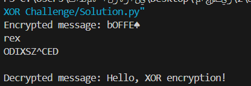

## Introduction

This program demonstrates how to use XOR encryption and decryption in Python. XOR (exclusive OR) is a simple bitwise operation that can be used to encrypt and decrypt data. It is often used in practice for simple encryption schemes due to its efficiency and simplicity. The same XOR operation can be used for both encryption and decryption, making it symmetric.

## How XOR Works

In XOR encryption, each character of the message is transformed by applying the XOR operation between its ASCII value and a secret key. To decrypt the message, we use the same XOR operation with the same key, which will reverse the encryption process and restore the original message.

The XOR operation has the following properties:

1. `a ^ a = 0` (XOR of a value with itself results in zero).
2. `a ^ 0 = a` (XOR of a value with zero results in the value itself).

### Example

```python
def xor_encrypt_decrypt(data, key):
    result = ""
    for char in data:
        result += chr(ord(char) ^ key)
    return result

message = "Hello, XOR encryption!"
key = 42
encrypted_message = xor_encrypt_decrypt(message, key)
print("Encrypted message:", encrypted_message)

decrypted_message = xor_encrypt_decrypt(encrypted_message, key)
print("Decrypted message:", decrypted_message)
```

### Output



### How the Code Works

The function `xor_encrypt_decrypt(data, key)` performs both encryption and decryption using the XOR operation. Here’s how it works:

- **Input**: The function takes two arguments:

  - `data`: A string to be encrypted or decrypted.
  - `key`: A number used for the XOR operation.

- **Process**:

  1. The function loops through each character in the `data` string.
  2. For each character, it converts the character to its ASCII value using the `ord()` function.
  3. The XOR operation (`^`) is applied between the ASCII value of the character and the `key`.
  4. The result is converted back to a character using the `chr()` function.
  5. The transformed characters are combined into a new string, which is returned as the encrypted or decrypted data.

- **Encryption**:
  When we apply the XOR operation on the original message with a key, we get an encrypted message.
- **Decryption**:
  Since XOR is a symmetric operation (i.e., `a ^ b ^ b = a`), applying the same operation with the same key on the encrypted message will decrypt it, restoring the original message.

### Source Reference:

For more details on how XOR works in Python, check out this [tutorial on Python XOR encryption](https://tutorpython.com/python-xor/).
