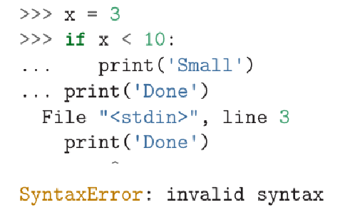

### **• What is the compound statements?**

**compound statement** A statement that consists of a `header` and a `body`. The header ends with a colon (`:`). The body is indented relative to the header.

### **• When you must leave a blank line at the end of a block and when we should do so?**

When using the `Python interpreter`, we must leave a blank line at the end of a block

A blank line at the end of a block of statements is not necessary when writing and executing a `script`, but it may improve readability of your code.
