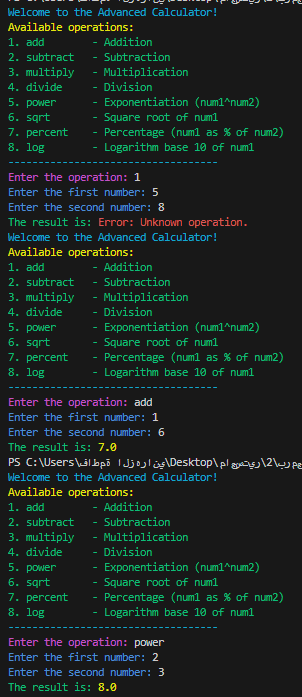
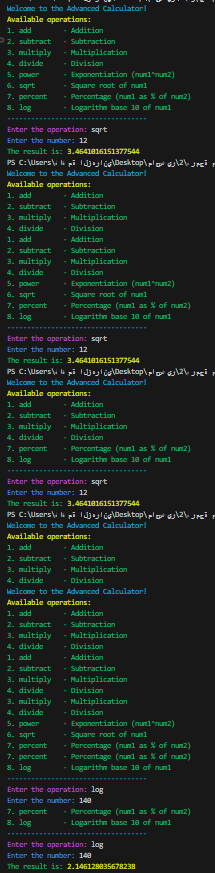

This project is a Python-based console calculator that supports **basic** and **advanced** mathematical operations. It is a **challenge of my own choosing** to combine the ideas and concepts I have learned so far in Python, such as modular programming, error handling, user input validation, and third-party libraries.

---

## Features

### Basic Operations:

- **Addition** (`add`): Adds two numbers.
- **Subtraction** (`subtract`): Subtracts the second number from the first.
- **Multiplication** (`multiply`): Multiplies two numbers.
- **Division** (`divide`): Divides the first number by the second (with error handling for division by zero).

### Advanced Operations:

- **Exponentiation** (`power`): Calculates the power of the first number raised to the second.
- **Square Root** (`sqrt`): Calculates the square root of a single number.
- **Percentage** (`percent`): Finds what percentage the first number is of the second.
- **Logarithm** (`log`): Calculates the base-10 logarithm of a single number.

---

## Code Structure

### calculator.py:

This file contains the `calculate` function, which processes all operations. The function uses the following logic:

- Handles basic operations like addition, subtraction, multiplication, and division.
- Supports advanced mathematical functions like exponentiation, square root, percentage, and logarithm.
- Includes error handling for invalid inputs, division by zero, and negative square roots.

### main.py:

This file handles:

- Displaying the list of available operations.
- Accepting user inputs for numbers and operations.
- Calling the `calculate` function from `calculator.py`.
- Printing the results with color-coded feedback using `colorama`.

## Supported Operations

| Operation      | Command    | Description                                                      |
| -------------- | ---------- | ---------------------------------------------------------------- |
| Addition       | `add`      | Adds two numbers.                                                |
| Subtraction    | `subtract` | Subtracts the second number from the first.                      |
| Multiplication | `multiply` | Multiplies two numbers.                                          |
| Division       | `divide`   | Divides the first number by the second (except zero).            |
| Power          | `power`    | Raises the first number to the power of the second.              |
| Square Root    | `sqrt`     | Finds the square root of a single number.                        |
| Percentage     | `percent`  | Calculates the percentage of the first number out of the second. |
| Logarithm      | `log`      | Finds the base-10 logarithm of a single number.                  |

## Example Usage

## Error Handling

- Division by Zero: Displays an error message.
- Invalid Operations: Notifies the user about unknown operations.
- Invalid Inputs: Handles non-numeric or inappropriate inputs gracefully.
- Negative Square Roots: Alerts the user that negative numbers are not supported for square root.
